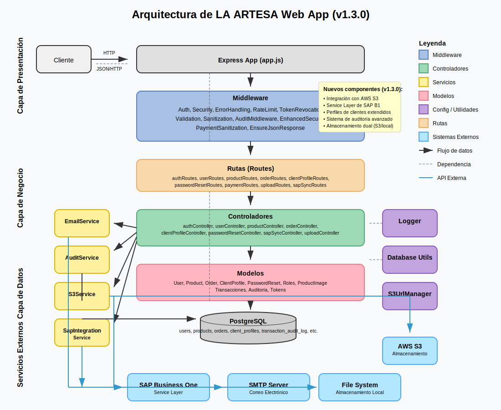

# **LA ARTESA - WEB APP Documentation**

Este proyecto es una API RESTful para la aplicación web **LA ARTESA**, que permite gestionar usuarios, autenticación, productos, pedidos, perfiles de clientes y otras funcionalidades relacionadas con SAP Business One.

---

## **Tabla de Contenidos**
1. [Requisitos](#requisitos)
2. [Configuración del Proyecto](#configuración-del-proyecto)
   - [Instalación](#instalación)
   - [Variables de Entorno](#variables-de-entorno)
3. [Arquitectura del Sistema](#arquitectura-del-sistema)
4. [Estructura del Proyecto](#estructura-del-proyecto)
5. [Base de Datos](#base-de-datos)
   - [Estructura de Tablas](#estructura-de-tablas)
   - [Tipos de Datos Personalizados](#tipos-de-datos-personalizados)
6. [Autenticación y Seguridad](#autenticación-y-seguridad)
   - [JWT](#jwt)
   - [Sistema de Roles](#sistema-de-roles)
   - [Recuperación de Contraseña](#recuperación-de-contraseña)
   - [Rate Limiting y Protección](#rate-limiting-y-protección)
7. [Endpoints](#endpoints)
   - [Autenticación](#autenticación)
   - [Usuarios](#usuarios)
   - [Productos](#productos)
   - [Pedidos](#pedidos)
   - [Perfiles de Clientes](#perfiles-de-clientes)
   - [Pagos](#pagos)
8. [Subida de Archivos](#subida-de-archivos)
9. [Sistema de Auditoría](#sistema-de-auditoría)
10. [Ejecución del Proyecto](#ejecución-del-proyecto)
11. [Documentación de la API](#documentación-de-la-api)
12. [Logs y Monitoreo](#logs-y-monitoreo)
13. [Seguridad](#seguridad)

---

## **Requisitos**
- Node.js (v16 o superior)
- PostgreSQL (v12 o superior)
- npm (v8 o superior)

---

## **Configuración del Proyecto**

### **Instalación**

1. **Clonar el Repositorio**
```bash
git clone https://github.com/Jaycoach/ARTESA_WEBAPP.git
cd ARTESA_WEBAPP
```

2. **Instalar Dependencias**
```bash
npm install
```

### **Variables de Entorno**

Crea un archivo `.env` en la raíz del proyecto con las siguientes variables:

```env
# Configuración del servidor
PORT=3000
NODE_ENV=development

# Configuración de la base de datos
DB_HOST=localhost
DB_USER=tu_usuario
DB_PASSWORD=tu_contraseña
DB_DATABASE=ARTESA_WEBAPP
DB_PORT=5432

# Configuración de JWT
JWT_SECRET=tu_secreto_jwt_seguro

# Configuración de Email (para recuperación de contraseña)
SMTP_HOST=tu_servidor_smtp
SMTP_PORT=587
SMTP_USER=tu_usuario_smtp
SMTP_PASS=tu_contraseña_smtp
SMTP_FROM=noreply@tudominio.com
FRONTEND_URL=http://localhost:5173

# Configuración de Multer (Local)
UPLOADS_DIR=uploads

# Configuración de AWS S3 (para producción)
AWS_ACCESS_KEY_ID=tu_access_key_id
AWS_SECRET_ACCESS_KEY=tu_secret_access_key
AWS_REGION=tu_region
AWS_S3_BUCKET_NAME=nombre_de_tu_bucket_s3

# URL de desarrollo Ngrok (opcional)
DEV_NGROK_URL=https://tu-subdominio.ngrok-free.app

# URL de producción (opcional)
PROD_URL=https://tu-dominio-de-produccion.com
```
---

## **Arquitectura del Sistema**

LA ARTESA Web App utiliza una arquitectura en capas con separación clara de responsabilidades, siguiendo el patrón MVC adaptado para una API RESTful.



### Componentes Principales

- **Express App**: Punto de entrada principal que configura el servidor y registra las rutas
- **Middleware**: Autenticación, seguridad, manejo de errores y validación
- **Rutas**: Definen los endpoints de la API y dirigen las solicitudes
- **Controladores**: Implementan la lógica de negocio para cada tipo de solicitud
- **Servicios**: Proporcionan funcionalidades transversales como correo electrónico y auditoría
- **Modelos**: Encapsulan la lógica de acceso a datos y reglas de negocio
- **Base de Datos**: PostgreSQL para almacenamiento persistente

Para una descripción detallada de la arquitectura, consulte la [documentación técnica](scripts/docs/ARCHITECTURE.md).
---

## **Estructura del Proyecto**

```
/
├── app.js                       # Punto de entrada principal del servidor
├── package.json                 # Configuración de dependencias y scripts
├── scripts/                     # Scripts utilitarios
│   ├── generateDbDocs.js        # Genera documentación de la base de datos
│   ├── generate-swagger.js      # Genera documentación Swagger
│   └── hashPasswords.js         # Utilidad para hashear contraseñas
├── src/
│   ├── config/                  # Configuraciones
│   │   ├── db.js                # Configuración de la base de datos
│   │   ├── express-swagger.js   # Configuración de Swagger para Express
│   │   ├── logger.js            # Configuración del sistema de logs
│   │   └── swagger.js           # Definiciones de Swagger
│   ├── controllers/             # Controladores de la API
│   │   ├── authController.js    # Controlador de autenticación
│   │   ├── clientProfileController.js # Controlador de perfiles de clientes
│   │   ├── orderController.js   # Controlador de pedidos
│   │   ├── passwordResetController.js # Controlador de reseteo de contraseñas
│   │   ├── productController.js # Controlador de productos
│   │   ├── uploadController.js  # Controlador de subida de archivos
│   │   └── userController.js    # Controlador de usuarios
│   ├── middleware/              # Middlewares
│   │   ├── auth.js              # Middleware de autenticación
│   │   ├── auditMiddleware.js   # Middleware de auditoría
│   │   ├── enhancedSecurity.js  # Configuraciones avanzadas de seguridad
│   │   ├── errorMiddleware.js   # Manejo centralizado de errores
│   │   ├── paymentSanitization.js # Sanitización para pagos
│   │   └── security.js          # Middleware de seguridad general
│   ├── models/                  # Modelos de datos
│   │   ├── clientProfile.js     # Modelo de perfiles de cliente
│   │   ├── Order.js             # Modelo de pedidos
│   │   ├── PasswordReset.js     # Modelo de reseteo de contraseñas
│   │   ├── Product.js           # Modelo de productos
│   │   ├── Roles.js             # Modelo de roles
│   │   └── userModel.js         # Modelo de usuarios
│   ├── routes/                  # Rutas de la API
│   │   ├── authRoutes.js        # Rutas de autenticación
│   │   ├── clientProfileRoutes.js # Rutas de perfiles de clientes
│   │   ├── orderRoutes.js       # Rutas de pedidos
│   │   ├── passwordResetRoutes.js # Rutas de reseteo de contraseñas
│   │   ├── paymentRoutes.js     # Rutas de pagos
│   │   ├── productRoutes.js     # Rutas de productos
│   │   ├── secureProductRoutes.js # Rutas protegidas de productos
│   │   ├── uploadRoutes.js      # Rutas para subida de archivos
│   │   └── userRoutes.js        # Rutas de usuarios
│   ├── security/                # Componentes adicionales de seguridad
│   │   └── index.js             # Fachada de implementaciones de seguridad
│   ├── services/                # Servicios
│   │   ├── AuditService.js      # Servicio de auditoría
│   │   └── EmailService.js      # Servicio de correo electrónico
│   ├── utils/                   # Utilidades
│   │   └── dbUtils.js           # Utilidades para la base de datos
│   └── validators/              # Validadores
│       ├── authValidators.js    # Validadores de autenticación
│       └── paymentValidators.js # Validadores de pagos
├── uploads/                     # Directorio para archivos subidos
│   └── client-profiles/         # Archivos de perfiles de clientes
└── public/                      # Activos públicos
    └── swagger.json             # Documentación generada de la API
```

---

## **Base de Datos**

### **Estructura de Tablas**

La base de datos PostgreSQL contiene las siguientes tablas principales:

| Tabla | Descripción |
|-------|-------------|
| `users` | Usuarios del sistema con sus credenciales y roles |
| `roles` | Roles de usuario (Admin, User) |
| `products` | Catálogo de productos con precios y detalles |
| `orders` | Pedidos realizados por los usuarios |
| `order_details` | Detalles de productos en cada pedido |
| `client_profiles` | Perfiles de clientes comerciales con documentación |
| `password_resets` | Tokens para recuperación de contraseñas |
| `login_history` | Historial de intentos de login |
| `transactions` | Transacciones de pago relacionadas con órdenes |
| `transaction_audit_log` | Registro de auditoría de transacciones |
| `audit_anomalies` | Anomalías detectadas en transacciones |

Para una referencia completa de todas las tablas, consulta el archivo [database-structure.md](./docs/database-structure.md).

### **Tipos de Datos Personalizados**

La base de datos utiliza los siguientes tipos ENUM personalizados:

- `audit_event_type`: Tipos de eventos de auditoría (`PAYMENT_INITIATED`, `PAYMENT_PROCESSED`, etc.)
- `severity_level`: Niveles de severidad (`INFO`, `WARNING`, `ERROR`, `CRITICAL`)
- `documento_tipo`: Tipos de documentos de identidad (`CC`, `CE`, `PASAPORTE`)
- `cuenta_tipo`: Tipos de cuentas bancarias (`Ahorros`, `Corriente`)
- `empresa_tamano`: Tamaños de empresa (`Microempresa`, `Pequeña`, `Mediana`, `Grande`)

---

## **Autenticación y Seguridad**

### **JWT**

El sistema utiliza JSON Web Tokens (JWT) para la autenticación. Cada token incluye:

- ID de usuario
- Correo electrónico
- Nombre
- ID de rol
- Nombre de rol

Los tokens expiran después de 24 horas, y se verifican en cada solicitud protegida.

### **Sistema de Roles**

Existen dos roles principales en el sistema:

- **ADMIN (ID: 1)**: Acceso completo a todas las funcionalidades
- **USER (ID: 2)**: Acceso limitado a funcionalidades específicas

El middleware `checkRole` verifica si el usuario tiene permiso para acceder a cada endpoint.

### **Recuperación de Contraseña**

El sistema incluye un flujo completo de recuperación de contraseña:

1. El usuario solicita un reset de contraseña a través del endpoint `/api/password/request-reset`
2. Se genera un token criptográficamente seguro y se envía por correo
3. El usuario utiliza este token para establecer una nueva contraseña a través de `/api/password/reset`
4. Los tokens expiran después de una hora y son de un solo uso

### **Rate Limiting y Protección**

Para prevenir ataques de fuerza bruta y asegurar la disponibilidad del servicio:

- Rate limiting en endpoints de autenticación: 5 intentos cada 15 minutos
- Rate limiting en endpoints sensibles: 50 solicitudes cada 15 minutos
- Rate limiting en endpoints estándar: 100 solicitudes cada 15 minutos
- Bloqueo de cuentas después de múltiples intentos fallidos de login
- Headers de seguridad para prevenir XSS, clickjacking y otros ataques

---

## **Endpoints**

### **Autenticación**

| Método | Ruta | Descripción | Roles |
|--------|------|-------------|-------|
| POST | `/api/auth/login` | Iniciar sesión | Público |
| POST | `/api/auth/register` | Registrar nuevo usuario | Público |
| POST | `/api/password/request-reset` | Solicitar recuperación de contraseña | Público |
| POST | `/api/password/reset` | Establecer nueva contraseña | Público |

### **Usuarios**

| Método | Ruta | Descripción | Roles |
|--------|------|-------------|-------|
| GET | `/api/users` | Obtener todos los usuarios | ADMIN |
| GET | `/api/users/:id` | Obtener usuario por ID | ADMIN, propietario |
| PUT | `/api/users/:id` | Actualizar usuario | ADMIN, propietario |

### **Productos**

| Método | Ruta | Descripción | Roles |
|--------|------|-------------|-------|
| GET | `/api/products` | Obtener todos los productos | ADMIN, USER |
| GET | `/api/products/:productId` | Obtener producto por ID | ADMIN, USER |
| POST | `/api/products` | Crear nuevo producto | ADMIN |
| PUT | `/api/products/:productId` | Actualizar producto | ADMIN |
| PUT | `/api/products/:productId/image` | Actualizar imagen de producto | ADMIN |
| DELETE | `/api/products/:productId` | Eliminar producto | ADMIN |

### **Pedidos**

| Método | Ruta | Descripción | Roles |
|--------|------|-------------|-------|
| POST | `/api/orders` | Crear un nuevo pedido | ADMIN, USER |
| GET | `/api/orders/:orderId` | Obtener detalles de un pedido | ADMIN, propietario |
| GET | `/api/orders/user/:userId` | Obtener pedidos de un usuario | ADMIN, propietario |

### **Perfiles de Clientes**

| Método | Ruta | Descripción | Roles |
|--------|------|-------------|-------|
| GET | `/api/client-profiles` | Obtener todos los perfiles | ADMIN |
| GET | `/api/client-profiles/:id` | Obtener perfil por ID | ADMIN, USER |
| GET | `/api/client-profiles/user/:userId` | Obtener perfil por ID de usuario | ADMIN, propietario |
| POST | `/api/client-profiles` | Crear perfil de cliente | ADMIN |
| PUT | `/api/client-profiles/:id` | Actualizar perfil | ADMIN |
| DELETE | `/api/client-profiles/:id` | Eliminar perfil | ADMIN |
| GET | `/api/client-profiles/:id/file/:fileType` | Obtener archivo de perfil | ADMIN, USER |
| GET | `/api/client-profiles/user/:userId/file/:fileType` | Obtener archivo por ID de usuario | ADMIN, propietario |

### **Pagos**

| Método | Ruta | Descripción | Roles |
|--------|------|-------------|-------|
| POST | `/api/payments/process` | Procesar un pago | ADMIN, USER |
| GET | `/api/payments/status/:transactionId` | Verificar estado de un pago | ADMIN, propietario |

---

## **Subida de Archivos**

El sistema permite subir archivos utilizando Express-FileUpload:

- **Imágenes de productos**: A través de `/api/products/:productId/image`
- **Documentos de perfiles de clientes**: A través de `/api/client-profiles`
  - Fotocopia de cédula
  - Fotocopia de RUT
  - Anexos adicionales
- **Imágenes generales**: A través de `/api/upload/images`

Límites y restricciones:
- Tamaño máximo: 10MB
- Formatos aceptados: jpg, jpeg, png, gif, webp para imágenes
- Todos los archivos se almacenan en el directorio `uploads/` con nombres únicos

En producción, los archivos se pueden almacenar en Amazon S3 configurando las variables de entorno correspondientes.

---

## **Sistema de Auditoría**

El sistema cuenta con un robusto sistema de auditoría que registra:

- Intentos de login (exitosos y fallidos)
- Transacciones de pago
- Acciones de usuarios en datos sensibles
- Eventos de seguridad

Características:
- Detección automática de anomalías
- Diferentes niveles de severidad (INFO, WARNING, ERROR, CRITICAL)
- Almacenamiento en base de datos para análisis posterior
- Redacción automática de datos sensibles

La tabla `transaction_audit_log` almacena todos los eventos con detalles como:
- Usuario que realizó la acción
- Dirección IP
- Timestamp
- Detalles de la acción
- Nivel de severidad

---

## **Ejecución del Proyecto**

### **Desarrollo**

```bash
# Con nodemon para recarga automática
npm run dev

# Con conexión ngrok (para pruebas externas)
npm run start:ngrok
```

### **Producción**

```bash
npm run start:prod
```

### **Herramientas adicionales**

```bash
# Generar documentación Swagger
npm run generate-swagger

# Hashear contraseñas existentes en la base de datos
node scripts/hashPasswords.js

# Generar documentación de la base de datos
node scripts/generateDbDocs.js
```

---

## **Documentación de la API**

La documentación interactiva de la API está disponible en Swagger UI:

- Desarrollo: `http://localhost:3000/api-docs`
- Producción: `https://tu-dominio.com/api-docs`

También se puede acceder al archivo JSON de la especificación en:
- `http://localhost:3000/swagger.json`

La documentación incluye:
- Todos los endpoints disponibles
- Esquemas de solicitud y respuesta
- Parámetros requeridos
- Ejemplos de uso
- Funcionalidad "Try It Out" para probar endpoints directamente

---

## **Logs y Monitoreo**

El sistema utiliza Winston para el logging con las siguientes características:

- Rotación diaria de archivos de log
- Niveles configurables según entorno (debug en desarrollo, info en producción)
- Formato JSON para facilitar análisis
- Logs específicos para:
  - Errores (`logs/%DATE%-error.log`)
  - Aplicación general (`logs/%DATE%-app.log`)
  - Auditoría

Los logs incluyen:
- Timestamp
- Contexto (componente que genera el log)
- Nivel de severidad
- Mensaje
- Datos adicionales relevantes
- Stack trace para errores

---

## **Seguridad**

El proyecto implementa múltiples capas de seguridad:

### **Protección de datos**
- Contraseñas hasheadas con bcrypt
- Validación y sanitización de entradas
- Parámetros preparados en consultas SQL para prevenir inyección
- Redacción de datos sensibles en logs

### **Protección de API**
- Autenticación JWT
- Middleware CORS configurado
- Rate limiting adaptativo
- Headers de seguridad HTTP:
  - Content-Security-Policy
  - X-Content-Type-Options
  - X-Frame-Options
  - X-XSS-Protection
  - Strict-Transport-Security (en producción)

### **Monitoreo de seguridad**
- Detección de actividad sospechosa
- Registro de intentos de login fallidos
- Alertas sobre anomalías en transacciones
- Auditoría completa de acciones sensibles

---

> **Nota**: Esta documentación está actualizada al 28 de Febrero de 2025. Consulta el [CHANGELOG.md](./CHANGELOG.md) para ver el historial completo de cambios.