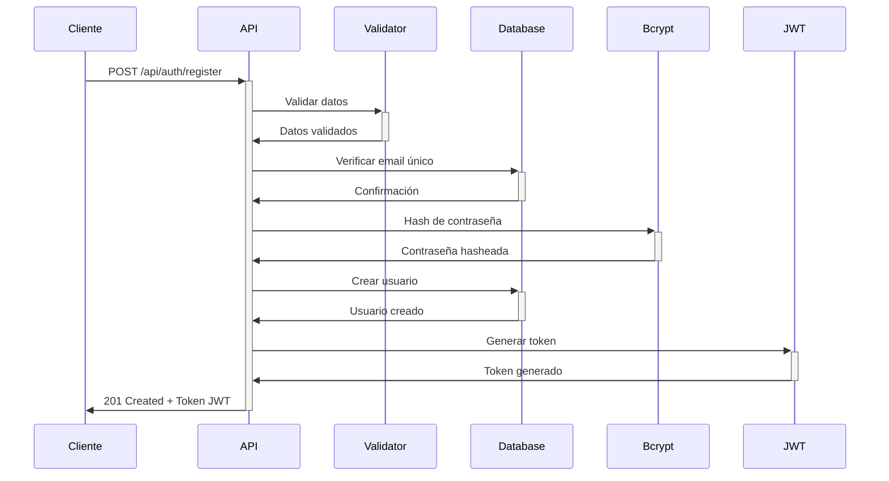
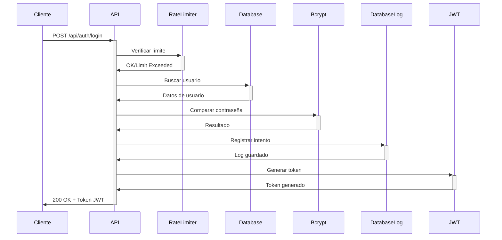

# Sistema de Autenticación de LA ARTESA API

Este documento describe en detalle el sistema de autenticación utilizado en la API de LA ARTESA, incluyendo flujos de autenticación, manejo de tokens, roles y permisos, y consideraciones de seguridad.

## Visión General

LA ARTESA API implementa un sistema de autenticación basado en JSON Web Tokens (JWT) con los siguientes componentes principales:

- Autenticación de usuarios mediante credenciales (email/contraseña)
- Generación de tokens JWT con payload que incluye información del usuario y roles
- Verificación de tokens en rutas protegidas
- Sistema de roles y permisos basado en middlewares
- Mecanismos de seguridad como rate limiting y detección de actividad sospechosa

## Flujos de Autenticación

### 1. Registro de Usuarios



#### Endpoint: `POST /api/auth/register`

**Descripción:** Registra un nuevo usuario en el sistema y devuelve un token JWT para autenticación inmediata.

**Payload:**
```json
{
  "name": "John Doe",
  "mail": "john@example.com",
  "password": "Contraseña123"
}
```

**Respuesta:**
```json
{
  "success": true,
  "message": "Usuario registrado exitosamente",
  "data": {
    "token": "eyJhbGciOiJIUzI1NiIsInR...",
    "user": {
      "id": 1,
      "name": "John Doe",
      "mail": "john@example.com",
      "role": {
        "id": 2,
        "name": "USER"
      }
    }
  }
}
```

**Notas:**
- Por defecto, los usuarios nuevos reciben el rol "USER" (ID: 2)
- Las contraseñas se hashean con bcrypt antes de almacenarse
- La validación incluye complejidad de contraseña y formato de email

### 2. Login de Usuarios



#### Endpoint: `POST /api/auth/login`

**Descripción:** Autentica al usuario y devuelve un token JWT válido por 24 horas.

**Payload:**
```json
{
  "mail": "john@example.com",
  "password": "Contraseña123"
}
```

**Respuesta:**
```json
{
  "success": true,
  "message": "Login exitoso",
  "data": {
    "token": "eyJhbGciOiJIUzI1NiIsInR...",
    "user": {
      "id": 1,
      "name": "John Doe",
      "mail": "john@example.com",
      "role": {
        "id": 2,
        "name": "USER"
      }
    }
  }
}
```

**Seguridad:**
- Rate limiting: 5 intentos cada 15 minutos
- Registro de intentos fallidos en `login_history`
- Bloqueo de cuenta después de múltiples intentos fallidos

### 3. Recuperación de Contraseña

LA ARTESA implementa un flujo completo de recuperación de contraseña:

#### Solicitud de recuperación: `POST /api/password/request-reset`

**Payload:**
```json
{
  "mail": "john@example.com"
}
```

**Respuesta:**
```json
{
  "message": "Si el correo existe, recibirás instrucciones para restablecer tu contraseña"
}
```

**Notas:**
- Para prevenir enumeración de usuarios, siempre devuelve el mismo mensaje independientemente de si el correo existe
- Genera un token criptográficamente seguro (64 caracteres hexadecimales)
- El token expira después de 1 hora
- Envía un correo con un enlace seguro al frontend

#### Restablecimiento de contraseña: `POST /api/password/reset`

**Payload:**
```json
{
  "token": "8f7d8fca7e3b2a1d6e5f4c3b2a1d6e5f4c3b2a1d6e5f4c3b2a1d6e5f4c3b2a1d",
  "newPassword": "NuevaContraseña123"
}
```

**Respuesta:**
```json
{
  "success": true,
  "message": "Contraseña actualizada exitosamente"
}
```

**Validaciones:**
- Verifica que el token sea válido y no haya expirado
- Verifica que la nueva contraseña cumpla los requisitos de seguridad
- Verifica que la nueva contraseña no sea igual a la anterior

## Estructura del Token JWT

### Payload

```json
{
  "id": 1,
  "mail": "john@example.com",
  "name": "John Doe",
  "rol_id": 2,
  "role": "USER",
  "iat": 1645557124,
  "exp": 1645643524
}
```

### Configuración

- **Algoritmo**: HS256
- **Tiempo de expiración**: 24 horas
- **Secret**: Configurado mediante variable de entorno `JWT_SECRET`

## Middleware de Autenticación

### verifyToken

`verifyToken` es un middleware que valida el token JWT y añade la información del usuario al objeto `req`:

```javascript
const verifyToken = (req, res, next) => {
  try {
      const authHeader = req.headers.authorization;
      
      if (!authHeader) {
          return res.status(401).json({
              status: 'error',
              message: 'No se proporcionó token de acceso'
          });
      }

      if (!authHeader.startsWith('Bearer ')) {
          return res.status(401).json({
              status: 'error',
              message: 'Formato de token inválido. Use: Bearer <token>'
          });
      }

      const token = authHeader.split(' ')[1];
      const decoded = jwt.verify(token, process.env.JWT_SECRET);
      
      req.user = {
          id: decoded.id,
          mail: decoded.mail,
          name: decoded.name,
          rol_id: decoded.rol_id
      };
      
      next();
  } catch (error) {
      return res.status(401).json({
          status: 'error',
          message: 'Token inválido o expirado',
          details: process.env.NODE_ENV === 'development' ? error.message : undefined
      });
  }
};
```

### checkRole

`checkRole` es un middleware que verifica si el usuario tiene los roles necesarios para acceder a un recurso:

```javascript
const checkRole = (allowedRoles) => {
  return (req, res, next) => {
    if (!req.user || !req.user.rol_id) {
      return res.status(403).json({
        status: 'error',
        message: 'Usuario sin rol asignado'
      });
    }

    // Si se pasa el rol como string, convertirlo a su ID correspondiente
    const roleIds = allowedRoles.map(role => {
      if (typeof role === 'string') {
        return role.toLowerCase() === 'admin' ? 1 : 2;
      }
      return role;
    });

    // Verificar si el rol del usuario está en los roles permitidos
    if (!roleIds.includes(req.user.rol_id)) {
      return res.status(403).json({
        status: 'error',
        message: 'No tiene permisos para realizar esta acción'
      });
    }

    next();
  };
};
```

## Sistema de Roles

LA ARTESA implementa un sistema de roles simple pero efectivo:

### Roles Disponibles

| ID | Nombre | Descripción |
|----|--------|-------------|
| 1 | ADMIN | Acceso completo a todas las funcionalidades del sistema |
| 2 | USER | Acceso limitado a funcionalidades específicas para usuarios regulares |

### Almacenamiento de Roles

Los roles se almacenan en la tabla `roles` de la base de datos:

```sql
CREATE TABLE roles (
  id INTEGER PRIMARY KEY,
  nombre VARCHAR NOT NULL UNIQUE,
  description TEXT,
  created_at TIMESTAMP DEFAULT CURRENT_TIMESTAMP
);
```

### Modelo de Roles

El modelo `Roles` proporciona una capa de abstracción para interactuar con los roles:

```javascript
class Roles {
    static instance = null;
    static roles = {};
    static lastUpdate = null;
    static updateInterval = 5 * 60 * 1000; // 5 minutos

    static async getRoles() {
        // Recargar roles si han pasado más de 5 minutos
        if (!this.lastUpdate || Date.now() - this.lastUpdate > this.updateInterval) {
            await this.loadRoles();
        }
        return this.roles;
    }

    static async getRoleId(roleName) {
        const roles = await this.getRoles();
        return roles[roleName.toUpperCase()];
    }
}
```

### Protección de Rutas por Rol

Las rutas se protegen combinando los middlewares `verifyToken` y `checkRole`:

```javascript
// Ruta accesible solo por administradores
router.get('/users', 
  verifyToken, 
  checkRole([1]), // Solo ADMIN (ID: 1)
  userController.getUsers
);

// Ruta accesible por administradores y usuarios regulares
router.get('/products', 
  verifyToken, 
  checkRole([1, 2]), // ADMIN y USER
  productController.getProducts
);

// Ruta accesible por el propietario del recurso o administradores
router.get('/users/:id', 
  verifyToken, 
  (req, res, next) => {
    // Lógica personalizada que permite acceso al propietario o admin
    const requestingUser = req.user;
    const requestedUserId = parseInt(req.params.id);
    
    if (requestingUser.id === requestedUserId || requestingUser.rol_id === 1) {
      next();
    } else {
      res.status(403).json({
        status: 'error',
        message: 'No tiene permisos para ver esta información'
      });
    }
  },
  userController.getUserById
);
```

## Buenas Prácticas de Seguridad

### 1. Manejo Seguro de Contraseñas

- Las contraseñas se hashean con bcrypt antes de almacenarse
- Se utilizan 10 rondas de hashing para equilibrar seguridad y rendimiento
- Nunca se almacenan ni transmiten contraseñas en texto plano

```javascript
const hashedPassword = await bcrypt.hash(password, 10);
```

### 2. Rate Limiting

Se implementa rate limiting para prevenir ataques de fuerza bruta:

```javascript
const loginLimiter = rateLimit({
    windowMs: 15 * 60 * 1000, // 15 minutos
    max: 5, // 5 intentos
    message: 'Demasiados intentos de login. Por favor, intenta más tarde.',
    standardHeaders: true,
    legacyHeaders: false
});
```

### 3. Registro de Intentos de Login

Todos los intentos de login, exitosos o fallidos, se registran en la tabla `login_history`:

```javascript
await pool.query(
    `INSERT INTO login_history 
    (user_id, ip_address, status, attempt_details, user_agent) 
    VALUES ($1, $2, $3, $4, $5)`,
    [userId, ipAddress, status, details, userAgent]
);
```

### 4. Bloqueo de Cuentas

Después de múltiples intentos fallidos, las cuentas se bloquean temporalmente:

```javascript
if (currentAttempts.count >= this.MAX_LOGIN_ATTEMPTS) {
    const timeElapsed = Date.now() - currentAttempts.timestamp;
    if (timeElapsed < this.LOCKOUT_TIME) {
        const remainingTime = Math.ceil((this.LOCKOUT_TIME - timeElapsed) / 1000);
        throw new Error(`Cuenta bloqueada. Intente nuevamente en ${remainingTime} segundos`);
    }
    currentAttempts.count = 0;
}
```

### 5. Headers de Seguridad

Se implementan headers de seguridad para prevenir diversos ataques:

```javascript
// Headers de seguridad
const securityHeaders = (req, res, next) => {
  // Prevenir clickjacking
  res.setHeader('X-Frame-Options', 'DENY');
  // Habilitar la protección XSS en navegadores antiguos
  res.setHeader('X-XSS-Protection', '1; mode=block');
  // Prevenir MIME-sniffing
  res.setHeader('X-Content-Type-Options', 'nosniff');
  // Política de seguridad de contenido
  res.setHeader('Content-Security-Policy', "default-src 'self'");
  // Strict Transport Security
  res.setHeader('Strict-Transport-Security', 'max-age=31536000; includeSubDomains');
  next();
};
```

### 6. Sanitización de Entradas

Todas las entradas se sanitizan para prevenir ataques de inyección:

```javascript
// Sanitizar strings
const sanitizeString = (str) => {
  if (!str) return str;
  return validator.escape(str.trim());
};

// Middleware para sanitizar el body
const sanitizeBody = (req, res, next) => {
  if (req.body) {
    const sanitizedBody = {};
    
    Object.keys(req.body).forEach(key => {
      const value = req.body[key];
      
      if (typeof value === 'string') {
        sanitizedBody[key] = sanitizeString(value);
      } else {
        sanitizedBody[key] = value;
      }
    });

    req.body = sanitizedBody;
  }
  next();
};
```

### 7. Tokens de Un Solo Uso

Los tokens de recuperación de contraseña son de un solo uso y expiran después de 1 hora:

```javascript
const markAsUsed = async (token) => {
  const query = `
    UPDATE password_resets
    SET used = true
    WHERE token = $1
    RETURNING *
  `;
  const result = await pool.query(query, [token]);
  return result.rows[0];
};
```

## Validación de Datos de Autenticación

### Validación de Email

```javascript
static validateEmail(req, res, next) {
    const { mail } = req.body;

    if (!mail) {
      return res.status(400).json({
        success: false,
        message: 'El correo electrónico es requerido'
      });
    }

    if (!validator.isEmail(mail)) {
      return res.status(400).json({
        success: false,
        message: 'El formato del correo electrónico no es válido'
      });
    }

    req.body.mail = validator.normalizeEmail(mail.toLowerCase());
    next();
}
```

### Validación de Contraseña

```javascript
static validatePassword = (req, res, next) => {
    const { password } = req.body;

    if (!password) {
      return res.status(400).json({
        success: false,
        message: 'La contraseña es requerida'
      });
    }

    if (password.length < passwordSchema.minLength || password.length > passwordSchema.maxLength) {
      return res.status(400).json({
        success: false,
        message: `La contraseña debe tener entre ${passwordSchema.minLength} y ${passwordSchema.maxLength} caracteres`
      });
    }

    next();
};
```

## Integración en el Frontend

### Ejemplo de Login

```javascript
// Función para iniciar sesión
const login = async (credentials) => {
  try {
    const response = await axios.post(`${API_URL}/auth/login`, credentials);
    
    if (response.data.success) {
      // Guardar el token en localStorage o en un estado seguro
      localStorage.setItem('authToken', response.data.data.token);
      
      // Guardar información del usuario
      setUser(response.data.data.user);
      
      return { success: true };
    }
  } catch (error) {
    const errorMessage = 
      error.response?.data?.message || 
      'Error al iniciar sesión. Intente nuevamente.';
    
    return { 
      success: false, 
      message: errorMessage,
      errorCode: error.response?.data?.errorCode
    };
  }
};
```

### Configuración de Axios con Token

```javascript
// Configurar interceptor para incluir token en todas las solicitudes
axios.interceptors.request.use(
  (config) => {
    const token = localStorage.getItem('authToken');
    
    if (token) {
      config.headers.Authorization = `Bearer ${token}`;
    }
    
    return config;
  },
  (error) => Promise.reject(error)
);

// Configurar interceptor para manejar errores de autenticación
axios.interceptors.response.use(
  (response) => response,
  (error) => {
    if (error.response?.status === 401) {
      // Token expirado o inválido
      localStorage.removeItem('authToken');
      // Redirigir a página de login
      window.location.href = '/login';
    }
    
    return Promise.reject(error);
  }
);
```

## Consideraciones para el Futuro

- **Autenticación de Dos Factores (2FA)**: Implementación de verificación adicional mediante SMS o aplicaciones como Google Authenticator
- **OAuth/OpenID Connect**: Integración con proveedores de identidad externos (Google, Microsoft, etc.)
- **Tokens de Refresco**: Implementación de refresh tokens para extender sesiones sin requerir reingreso de credenciales
- **Expiración Configurable**: Permitir configurar el tiempo de expiración de tokens según el nivel de seguridad requerido
- **Auditoría Avanzada**: Expansión del sistema de auditoría para incluir más eventos relacionados con autenticación y autorización